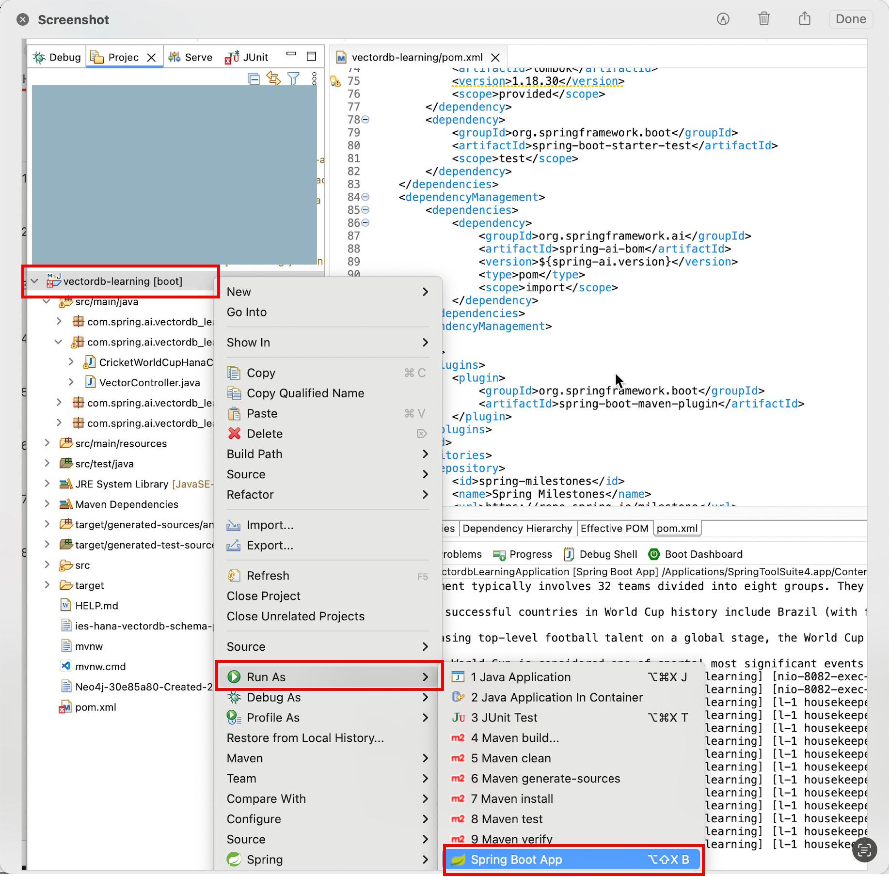

<h1 align="center">SpringAI Azure Learning</h1>
<p align="center"> 
    
</p>

<p align="center">
  <a href="#about">About</a> •
  <a href="#getting-started">Getting Started</a> •
  <a href="#azure-integration">Azure Integration</a> •
  <a href="#start-application">Start Application</a> •
  <a href="#swagger-ui">Swagger UI</a> •
  <a href="#contributors">Contributors</a>
</p>

## About
SpringAI Azure Learning Repo you will learn SpringAI Integration with Azure, Provide the RestAPI endpoints to Chat, Embeded & Prompting the Azure model. 

## Getting Started

This section offers jumping off points for how to get started using Spring AI.
You should follow the steps in each of the following section according to your needs.

#### Pre-Requisites 
- [Java17](https://www.oracle.com/java/technologies/javase/jdk17-archive-downloads.html)
- [Maven](https://maven.apache.org/install.html)
- [Azure portal](https://portal.azure.com/)
- [Git](https://git-scm.com/downloads)
  

### Clone Git Repo

Clone the repositoy from github account
```
git clone https://github.com/GAmaranathaReddy/springai-azure-learning.git
```

## Azure Integration

### Azure OpenAI

Azure’s OpenAI offering, powered by ChatGPT, extends beyond traditional OpenAI capabilities, delivering AI-driven text generation with enhanced functionality. Azure offers additional AI safety and responsible AI features, as highlighted in their recent update here.

Azure offers Java developers the opportunity to leverage AI’s full potential by integrating it with an array of Azure services, which includes AI-related resources such as Vector Stores on Azure.

### Auto-configuration

Spring AI provides Spring Boot auto-configuration for the Azure OpenAI Chat Client. To enable it add the following dependency to your project’s Maven pom.xml file:

```
<dependency>
    <groupId>org.springframework.ai</groupId>
    <artifactId>spring-ai-azure-openai-spring-boot-starter</artifactId>
</dependency>

```
### Azure Spring AI Properties
- [Azure chat properties](https://docs.spring.io/spring-ai/reference/api/chat/azure-openai-chat.html#_auto_configuration)
- [Azure Embedding properties](https://docs.spring.io/spring-ai/reference/api/embeddings/azure-openai-embeddings.html#_auto_configuration)

### Azure Chat Models API 

The Chat Model API offers developers the ability to integrate AI-powered chat completion capabilities into their applications. It leverages pre-trained language models, such as GPT (Generative Pre-trained Transformer), to generate human-like responses to user inputs in natural language.

The API typically works by sending a prompt or partial conversation to the AI model, which then generates a completion or continuation of the conversation based on its training data and understanding of natural language patterns. The completed response is then returned to the application, which can present it to the user or use it for further processing.

The Spring AI Chat Model API is designed to be a simple and portable interface for interacting with [various](https://docs.spring.io/spring-ai/reference/concepts.html#_models) AI Models, allowing developers to switch between different models with minimal code changes. This design aligns with Spring’s philosophy of modularity and interchangeability.

Also with the help of companion classes like Prompt for input encapsulation and ChatResponse for output handling, the Chat Model API unifies the communication with AI Models. It manages the complexity of request preparation and response parsing, offering a direct and simplified API interaction.


### Azure Embeded Models API 

The Embedding Model API is built on top of the generic Spring AI Model API, which is a part of the Spring AI library. As such, the EmbeddingModel interface extends the Model interface, which provides a standard set of methods for interacting with AI models. The EmbeddingRequest and EmbeddingResponse classes extend from the ModelRequest and ModelResponse are used to encapsulate the input and output of the embedding models, respectively.

The Embedding API in turn is used by higher-level components to implement Embedding Models for specific embedding models, such as OpenAI, Titan, Azure OpenAI, Ollie, and others.

Azure’s OpenAI extends the OpenAI capabilities, offering safe text generation and Embeddings computation models for various task:
- Similarity embeddings are good at capturing semantic similarity between two or more pieces of text.
- Text search embeddings help measure whether long documents are relevant to a short query.
- Code search embeddings are useful for embedding code snippets and embedding natural language search queries.

The Azure OpenAI embeddings rely on cosine similarity to compute similarity between documents and a query.

### Prompts

It is common to use the call method of ChatModel that takes a Prompt instance and returns an ChatResponse.

The Prompt class functions as a container for an organized series of Message objects, with each one forming a segment of the overall prompt. Every Message embodies a unique role within the prompt, differing in its content and intent. These roles can encompass a variety of elements, from user inquiries to AI-generated responses or relevant background information. This arrangement enables intricate and detailed interactions with AI models, as the prompt is constructed from multiple messages, each assigned a specific role to play in the dialogue.

Full reference [Link](https://docs.spring.io/spring-ai/reference/api/prompt.html)

### Chat Runtime Options

The [AzureOpenAiChatOptions.java](https://github.com/spring-projects/spring-ai/blob/main/models/spring-ai-azure-openai/src/main/java/org/springframework/ai/azure/openai/AzureOpenAiChatOptions.java) provides model configurations, such as the model to use, the temperature, the frequency penalty, etc.
On start-up, the default options can be configured with the AzureOpenAiChatModel(api, options) constructor or the spring.ai.azure.openai.chat.options.* properties.
At runtime you can override the default options by adding new, request specific, options to the Prompt call. For example to override the default model and temperature for a specific request:

```
ChatResponse response = chatModel.call(
    new Prompt(
        "Generate the names of 5 famous pirates.",
        AzureOpenAiChatOptions.builder()
            .withModel("gpt-4-o")
            .withTemperature(0.4)
        .build()
    ));
```

### Embeded Runtime Options

The AzureOpenAiEmbeddingOptions provides the configuration information for the embedding requests. The AzureOpenAiEmbeddingOptions offers a builder to create the options.

At start time use the AzureOpenAiEmbeddingModel constructor to set the default options used for all embedding requests. At run-time you can override the default options, by passing a AzureOpenAiEmbeddingOptions instance with your to the EmbeddingRequest request.

For example to override the default model name for a specific request:

```
EmbeddingResponse embeddingResponse = embeddingModel.call(
    new EmbeddingRequest(List.of("Hello World", "World is big and salvation is near"),
        AzureOpenAiEmbeddingOptions.builder()
        .withModel("Different-Embedding-Model-Deployment-Name")
        .build()));

```

## Start Application

To run the application, run the following command in a terminal window (in the complete) directory:

### Running on command line

```
./mvnw spring-boot:run
```
### Running on IDE
Right click on project , select on run icon slick on spring boot application


## Swagger UI

Once enter url in broswer automatically display swagger page


Swagger UI Youtube Demo link : [SwaggerUI Demo](https://youtu.be/xI9pA4p6u3Y)
